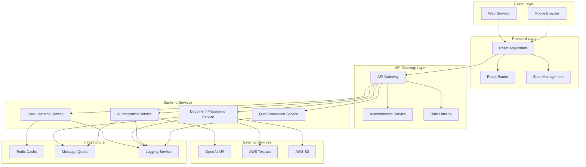

# Design Document: LearnSmart AI

## Overview

LearnSmart AI is a cloud-based adaptive learning assistant that leverages modern AI models to provide personalized educational experiences. The system follows a microservices architecture with a React-based frontend, Node.js backend services, and integration with cloud AI providers like OpenAI GPT-4/5.

The architecture prioritizes scalability, security, and user experience through:
- **Modular design** with clear separation between learning modes
- **Asynchronous processing** for AI model interactions and document processing
- **Responsive web interface** optimized for both desktop and mobile devices
- **Secure data handling** with encryption and privacy-first principles
- **Scalable infrastructure** supporting concurrent users and varying workloads

Key design principles include:
- **Privacy by design**: User data is processed securely and not permanently stored
- **Adaptive responses**: AI interactions are tailored to user experience level and learning context
- **Fault tolerance**: Graceful error handling and retry mechanisms for external dependencies
- **Performance optimization**: Caching, queuing, and efficient resource utilization

## Architecture

### System Architecture



### Service Architecture

The system employs a microservices architecture with the following key services:

**Frontend Service (React SPA)**
- Single-page application with responsive design
- Client-side routing for different learning modes
- Real-time UI updates and progress indicators
- File upload handling with drag-and-drop support

**API Gateway**
- Centralized entry point for all client requests
- Authentication and authorization enforcement
- Rate limiting and request throttling
- Request routing to appropriate backend services

**Core Learning Service**
- Orchestrates learning mode selection and context management
- Manages user sessions and learning state
- Coordinates between specialized services
- Handles response formatting and presentation logic

**AI Integration Service**
- Manages communication with external AI providers (OpenAI, Azure OpenAI)
- Implements retry logic and fallback mechanisms
- Handles prompt engineering for different learning modes
- Manages API key rotation and authentication

**Document Processing Service**
- Handles file uploads and validation
- Integrates with text extraction services (AWS Textract, PDF.js)
- Processes various document formats (PDF, TXT, DOCX)
- Implements secure temporary storage and cleanup

**Quiz Generation Service**
- Specializes in creating interactive quizzes
- Manages question templates and difficulty levels
- Handles answer validation and feedback generation
- Supports multiple question types and formats

## Components and Interfaces

### Frontend Components

**App Shell**
- Navigation bar with learning mode selection
- Responsive layout container
- Global state management setup
- Error boundary implementation

**Learning Mode Components**
- `ConceptExplainer`: Structured concept breakdown interface
- `CodeTutor`: Code input with syntax highlighting and explanation display
- `QuizGenerator`: Interactive quiz interface with immediate feedback
- `DocumentSummarizer`: File upload and summary display interface

**Shared Components**
- `ResponseFormatter`: Renders AI responses with proper formatting
- `LoadingIndicator`: Shows processing status and progress
- `ErrorDisplay`: User-friendly error messages and recovery options
- `FileUploader`: Drag-and-drop file upload with validation

### Backend Interfaces

**REST API Endpoints**

```typescript
// Core Learning API
POST /api/v1/explain
  Body: { concept: string, level: 'beginner' | 'intermediate' | 'advanced' }
  Response: { explanation: FormattedResponse, sessionId: string }

POST /api/v1/code/explain
  Body: { code: string, language?: string }
  Response: { explanation: FormattedResponse, suggestions: string[] }

POST /api/v1/quiz/generate
  Body: { topic: string, questionCount: number, difficulty: string }
  Response: { quiz: QuizData, sessionId: string }

POST /api/v1/quiz/submit
  Body: { sessionId: string, answers: Answer[] }
  Response: { results: QuizResults, feedback: string[] }

POST /api/v1/document/upload
  Body: FormData with file
  Response: { documentId: string, status: 'processing' | 'completed' }

GET /api/v1/document/{documentId}/summary
  Response: { summary: FormattedResponse, status: string }
```

**Internal Service Interfaces**

```typescript
// AI Integration Service
interface AIService {
  generateExplanation(prompt: string, context: LearningContext): Promise<AIResponse>
  generateQuiz(topic: string, options: QuizOptions): Promise<QuizData>
  summarizeContent(content: string, options: SummaryOptions): Promise<string>
}

// Document Processing Service
interface DocumentService {
  uploadDocument(file: File): Promise<DocumentMetadata>
  extractText(documentId: string): Promise<string>
  getProcessingStatus(documentId: string): Promise<ProcessingStatus>
}

// Response Formatting Service
interface FormatterService {
  formatExplanation(content: string, type: ExplanationType): FormattedResponse
  formatCode(code: string, language: string): FormattedCode
  formatQuiz(quizData: QuizData): FormattedQuiz
}
```

### Integration Patterns

**AI Model Integration**
- Implements circuit breaker pattern for external API calls
- Uses exponential backoff for retry logic
- Supports multiple AI providers with failover capability
- Implements request queuing for rate limit management

**Document Processing Pipeline**
- Asynchronous processing with status tracking
- Temporary file storage with automatic cleanup
- Support for multiple file formats through pluggable extractors
- Virus scanning and file validation before processing

**Caching Strategy**
- Redis-based caching for frequently requested explanations
- Session-based caching for user context and preferences
- Response caching with TTL based on content type
- Cache invalidation strategies for dynamic content

## Data Models

### Core Data Structures

```typescript
// User Session and Context
interface LearningSession {
  sessionId: string
  userId?: string  // Optional for anonymous users
  mode: LearningMode
  context: LearningContext
  createdAt: Date
  lastActivity: Date
  preferences: UserPreferences
}

interface LearningContext {
  experienceLevel: 'beginner' | 'intermediate' | 'advanced'
  previousTopics: string[]
  currentTopic?: string
  learningGoals: string[]
  preferredExplanationStyle: 'detailed' | 'concise' | 'visual'
}

interface UserPreferences {
  language: string
  theme: 'light' | 'dark'
  fontSize: 'small' | 'medium' | 'large'
  codeHighlighting: boolean
  autoSave: boolean
}

// Learning Content Models
interface ConceptExplanation {
  concept: string
  prerequisites: string[]
  steps: ExplanationStep[]
  examples: CodeExample[]
  relatedConcepts: string[]
  difficulty: number
}

interface ExplanationStep {
  stepNumber: number
  title: string
  content: string
  codeExample?: CodeExample
  visualAid?: string
}

interface CodeExample {
  language: string
  code: string
  explanation: string
  highlights: CodeHighlight[]
}

interface CodeHighlight {
  startLine: number
  endLine: number
  startColumn: number
  endColumn: number
  explanation: string
  type: 'syntax' | 'logic' | 'best-practice' | 'error'
}

// Quiz Models
interface QuizData {
  quizId: string
  topic: string
  questions: QuizQuestion[]
  timeLimit?: number
  difficulty: string
  metadata: QuizMetadata
}

interface QuizQuestion {
  questionId: string
  type: 'multiple-choice' | 'true-false' | 'code-completion'
  question: string
  options: QuizOption[]
  correctAnswer: string | string[]
  explanation: string
  difficulty: number
  tags: string[]
}

interface QuizOption {
  optionId: string
  text: string
  isCorrect: boolean
  explanation?: string
}

interface QuizResults {
  sessionId: string
  score: number
  totalQuestions: number
  correctAnswers: number
  timeSpent: number
  questionResults: QuestionResult[]
  recommendations: string[]
}

interface QuestionResult {
  questionId: string
  userAnswer: string | string[]
  isCorrect: boolean
  timeSpent: number
  feedback: string
}

// Document Processing Models
interface DocumentMetadata {
  documentId: string
  filename: string
  fileType: string
  fileSize: number
  uploadedAt: Date
  status: ProcessingStatus
  extractedText?: string
  summary?: DocumentSummary
}

interface DocumentSummary {
  mainTopics: string[]
  keyPoints: string[]
  summary: string
  wordCount: number
  readingTime: number
  difficulty: string
  suggestedQuestions: string[]
}

interface ProcessingStatus {
  status: 'uploaded' | 'processing' | 'completed' | 'failed'
  progress: number
  message?: string
  error?: ProcessingError
}

// Response Formatting Models
interface FormattedResponse {
  content: ContentBlock[]
  metadata: ResponseMetadata
  sessionId: string
}

interface ContentBlock {
  type: 'text' | 'code' | 'list' | 'heading' | 'quote' | 'image'
  content: string
  formatting?: FormattingOptions
  language?: string  // For code blocks
}

interface FormattingOptions {
  bold?: boolean
  italic?: boolean
  highlight?: boolean
  color?: string
  fontSize?: string
}

interface ResponseMetadata {
  generatedAt: Date
  processingTime: number
  aiModel: string
  confidence: number
  sources?: string[]
}

// Error Handling Models
interface ProcessingError {
  code: string
  message: string
  details?: any
  timestamp: Date
  recoverable: boolean
  suggestedAction?: string
}

interface APIError {
  status: number
  code: string
  message: string
  details?: any
  requestId: string
}
```

### Data Flow Patterns

**Request Processing Flow**
1. Client sends request to API Gateway
2. Gateway validates authentication and applies rate limiting
3. Request routed to appropriate service based on learning mode
4. Service processes request, potentially calling AI Integration Service
5. Response formatted by Response Formatter
6. Formatted response returned to client with session context

**Document Processing Flow**
1. Client uploads document through secure endpoint
2. Document validated and stored temporarily in secure storage
3. Text extraction initiated asynchronously
4. Processing status tracked and made available via polling endpoint
5. Extracted text processed by AI service for summarization
6. Summary formatted and cached for quick retrieval
7. Temporary files cleaned up after processing completion

**AI Integration Flow**
1. Service receives processing request with context
2. Request queued if rate limits are approaching
3. Prompt engineered based on learning mode and user context
4. AI API called with retry logic and circuit breaker protection
5. Response validated and processed
6. Result cached for similar future requests
7. Formatted response returned to calling service

## Correctness Properties

*A property is a characteristic or behavior that should hold true across all valid executions of a system—essentially, a formal statement about what the system should do. Properties serve as the bridge between human-readable specifications and machine-verifiable correctness guarantees.*

### Property 1: Concept Explanation Structure
*For any* technical concept request, the generated explanation should contain logical steps in a structured format with clear progression from basic to advanced concepts.
**Validates: Requirements 1.1**

### Property 2: Prerequisite Ordering
*For any* concept with known prerequisites, the explanation should include prerequisite information before the main concept explanation.
**Validates: Requirements 1.3**

### Property 3: Experience Level Adaptation
*For any* concept and different experience levels (beginner, intermediate, advanced), explanations should differ appropriately in complexity and detail level.
**Validates: Requirements 1.4**

### Property 4: Document Processing Round Trip
*For any* valid uploaded document, the system should successfully extract content and generate a summary that preserves the main topics and technical terms from the original.
**Validates: Requirements 2.1, 2.2, 2.5**

### Property 5: Response Formatting Consistency
*For any* generated response (explanation, summary, quiz, code analysis), the output should follow consistent formatting patterns with proper headings, structure, and visual organization.
**Validates: Requirements 1.2, 2.3, 3.4, 4.3, 7.1, 7.3, 7.4**

### Property 6: Code Analysis Completeness
*For any* submitted code snippet, the analysis should include language identification, line-by-line explanation, and syntax pattern recognition.
**Validates: Requirements 3.1, 3.2**

### Property 7: Error Detection and Correction
*For any* code snippet containing syntax or logical errors, the system should identify the errors and provide correction suggestions.
**Validates: Requirements 3.3**

### Property 8: Quiz Generation Completeness
*For any* topic request, generated quizzes should contain properly formatted multiple-choice questions with correct answers and explanations for all options.
**Validates: Requirements 4.1, 4.2**

### Property 9: Learning Mode Configuration
*For any* learning mode selection, the system should configure the interface and processing appropriately for that mode's specific objectives.
**Validates: Requirements 5.2, 5.4**

### Property 10: Session Context Preservation
*For any* mode switch or session activity, relevant context and user preferences should be maintained throughout the session lifecycle.
**Validates: Requirements 5.3**

### Property 11: AI Integration Request-Response Cycle
*For any* user request requiring AI processing, the system should successfully integrate with AI model services and validate responses before presentation.
**Validates: Requirements 6.1, 6.4**

### Property 12: Error Handling and Recovery
*For any* system failure (document processing, AI service unavailability), the system should provide descriptive error messages and implement appropriate retry mechanisms.
**Validates: Requirements 2.4, 6.3**

### Property 13: Session Data Management
*For any* user session, personal information should not persist beyond session boundaries, and session termination should result in proper data cleanup.
**Validates: Requirements 9.2, 9.4**

### Property 14: Concurrent Request Handling
*For any* set of concurrent user requests, the system should process them without interference or data corruption between different user sessions.
**Validates: Requirements 10.2**

### Property 15: Resource Isolation
*For any* intensive processing operation (large document processing), the system should handle the operation without blocking or degrading performance for other concurrent users.
**Validates: Requirements 10.4**

## Error Handling

### Error Categories and Responses

**Input Validation Errors**
- Invalid file formats or corrupted uploads
- Malformed code snippets or unsupported languages
- Empty or invalid concept requests
- Response: Clear error messages with suggested corrections and supported formats

**External Service Errors**
- AI model API failures or timeouts
- Document processing service unavailability
- Rate limiting from external providers
- Response: Graceful degradation with retry mechanisms and fallback options

**System Resource Errors**
- Memory limitations during large document processing
- Storage capacity issues for temporary files
- Network connectivity problems
- Response: Resource management with queuing and automatic cleanup

**Authentication and Authorization Errors**
- Invalid API keys or expired tokens
- Insufficient permissions for requested operations
- Session timeout or invalid session states
- Response: Secure error messages without exposing sensitive information

### Error Recovery Strategies

**Circuit Breaker Pattern**
- Monitors external service health and automatically fails fast when services are down
- Implements exponential backoff for retry attempts
- Provides fallback responses when possible

**Graceful Degradation**
- Continues operation with reduced functionality when non-critical services fail
- Provides cached responses when real-time processing is unavailable
- Maintains core functionality even during partial system failures

**User Communication**
- Provides clear, actionable error messages without technical jargon
- Suggests alternative approaches when primary methods fail
- Includes estimated recovery times for temporary issues

**Logging and Monitoring**
- Comprehensive error logging with correlation IDs for request tracking
- Real-time monitoring of error rates and system health
- Automated alerting for critical system failures

## Testing Strategy

### Dual Testing Approach

The testing strategy employs both unit testing and property-based testing as complementary approaches:

**Unit Tests** focus on:
- Specific examples and edge cases for each component
- Integration points between services
- Error conditions and boundary cases
- Mock external service responses
- UI component behavior and user interactions

**Property-Based Tests** focus on:
- Universal properties that hold across all valid inputs
- Comprehensive input coverage through randomization
- Correctness properties derived from requirements
- System behavior under various conditions

### Property-Based Testing Configuration

**Testing Framework**: Fast-check (JavaScript/TypeScript) for comprehensive property-based testing
**Test Configuration**: Minimum 100 iterations per property test to ensure thorough coverage
**Test Tagging**: Each property test references its corresponding design document property

**Property Test Examples**:

```typescript
// Property 1: Concept Explanation Structure
describe('Feature: learnsmart-ai, Property 1: Concept explanation structure', () => {
  it('should generate structured explanations for any technical concept', 
    fc.property(fc.string({ minLength: 3 }), async (concept) => {
      const explanation = await explainConcept(concept, 'beginner');
      expect(explanation.steps).toBeDefined();
      expect(explanation.steps.length).toBeGreaterThan(0);
      expect(explanation.steps.every(step => step.title && step.content)).toBe(true);
    })
  );
});

// Property 4: Document Processing Round Trip
describe('Feature: learnsmart-ai, Property 4: Document processing round trip', () => {
  it('should preserve main topics in document summaries',
    fc.property(fc.lorem({ maxCount: 1000 }), async (documentContent) => {
      const summary = await processDocument(documentContent);
      const originalTopics = extractTopics(documentContent);
      const summaryTopics = extractTopics(summary.content);
      expect(summaryTopics.some(topic => 
        originalTopics.includes(topic)
      )).toBe(true);
    })
  );
});
```

### Unit Testing Strategy

**Component Testing**:
- React component rendering and user interaction
- API endpoint request/response validation
- Service layer business logic verification
- Database integration and data persistence

**Integration Testing**:
- End-to-end learning mode workflows
- Document upload and processing pipelines
- AI service integration with mock responses
- Error handling across service boundaries

**Performance Testing**:
- Response time validation for standard operations
- Concurrent user simulation and load testing
- Memory usage monitoring during document processing
- API rate limiting and throttling verification

### Test Data Management

**Synthetic Data Generation**:
- Automated generation of test documents, code snippets, and concepts
- Randomized user preferences and session contexts
- Varied complexity levels for comprehensive testing

**Test Environment Isolation**:
- Separate test databases and storage systems
- Mock external services for consistent testing
- Automated test data cleanup and reset procedures

**Continuous Integration**:
- Automated test execution on code changes
- Property test results tracking and analysis
- Performance regression detection and alerting